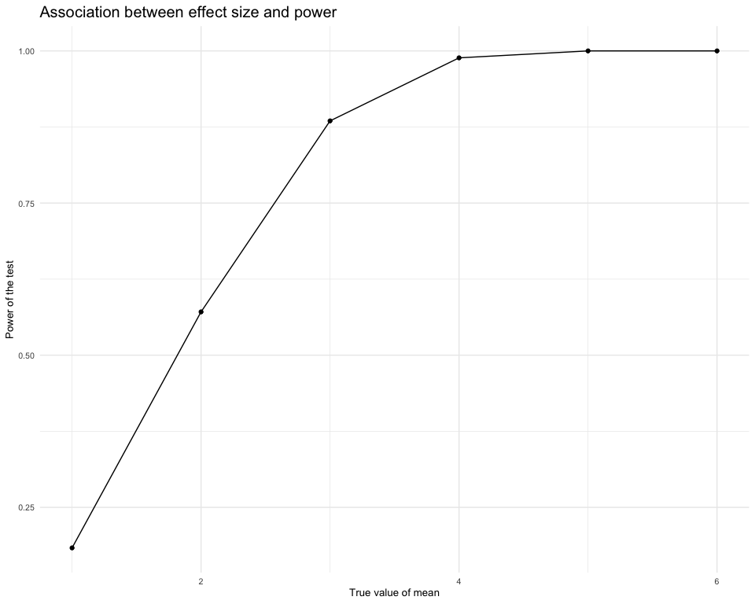
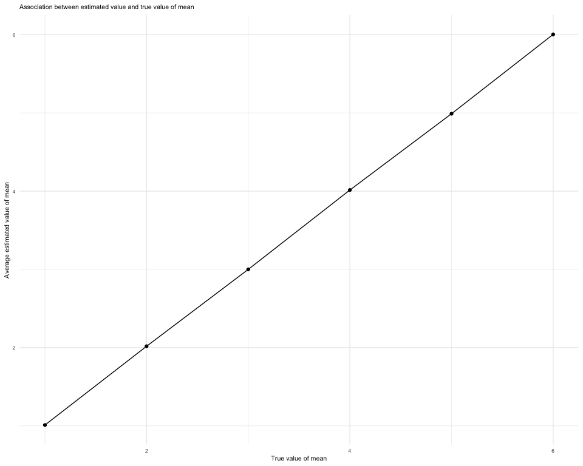

homework5
================
wz2631
2022-11-16

## Problem 1

The code chunk below imports the data in individual spreadsheets
contained in `./data/zip_data/`. To do this, the dataframe that includes
the list of all files in that directory and the complete path to each
file was created. Next, I `map` over paths and import data using the
`read_csv` function. Finally, I `unnest` the result of `map`.

``` r
full_df = 
  tibble(
    files = list.files("data/zip_data/"),
    path = str_c("data/zip_data/", files)
  ) %>% 
  mutate(data = map(path, read_csv)) %>% 
  unnest()
```

    ## Rows: 1 Columns: 8
    ## ── Column specification ────────────────────────────────────────────────────────
    ## Delimiter: ","
    ## dbl (8): week_1, week_2, week_3, week_4, week_5, week_6, week_7, week_8
    ## 
    ## ℹ Use `spec()` to retrieve the full column specification for this data.
    ## ℹ Specify the column types or set `show_col_types = FALSE` to quiet this message.
    ## Rows: 1 Columns: 8
    ## ── Column specification ────────────────────────────────────────────────────────
    ## Delimiter: ","
    ## dbl (8): week_1, week_2, week_3, week_4, week_5, week_6, week_7, week_8
    ## 
    ## ℹ Use `spec()` to retrieve the full column specification for this data.
    ## ℹ Specify the column types or set `show_col_types = FALSE` to quiet this message.
    ## Rows: 1 Columns: 8
    ## ── Column specification ────────────────────────────────────────────────────────
    ## Delimiter: ","
    ## dbl (8): week_1, week_2, week_3, week_4, week_5, week_6, week_7, week_8
    ## 
    ## ℹ Use `spec()` to retrieve the full column specification for this data.
    ## ℹ Specify the column types or set `show_col_types = FALSE` to quiet this message.
    ## Rows: 1 Columns: 8
    ## ── Column specification ────────────────────────────────────────────────────────
    ## Delimiter: ","
    ## dbl (8): week_1, week_2, week_3, week_4, week_5, week_6, week_7, week_8
    ## 
    ## ℹ Use `spec()` to retrieve the full column specification for this data.
    ## ℹ Specify the column types or set `show_col_types = FALSE` to quiet this message.
    ## Rows: 1 Columns: 8
    ## ── Column specification ────────────────────────────────────────────────────────
    ## Delimiter: ","
    ## dbl (8): week_1, week_2, week_3, week_4, week_5, week_6, week_7, week_8
    ## 
    ## ℹ Use `spec()` to retrieve the full column specification for this data.
    ## ℹ Specify the column types or set `show_col_types = FALSE` to quiet this message.
    ## Rows: 1 Columns: 8
    ## ── Column specification ────────────────────────────────────────────────────────
    ## Delimiter: ","
    ## dbl (8): week_1, week_2, week_3, week_4, week_5, week_6, week_7, week_8
    ## 
    ## ℹ Use `spec()` to retrieve the full column specification for this data.
    ## ℹ Specify the column types or set `show_col_types = FALSE` to quiet this message.
    ## Rows: 1 Columns: 8
    ## ── Column specification ────────────────────────────────────────────────────────
    ## Delimiter: ","
    ## dbl (8): week_1, week_2, week_3, week_4, week_5, week_6, week_7, week_8
    ## 
    ## ℹ Use `spec()` to retrieve the full column specification for this data.
    ## ℹ Specify the column types or set `show_col_types = FALSE` to quiet this message.
    ## Rows: 1 Columns: 8
    ## ── Column specification ────────────────────────────────────────────────────────
    ## Delimiter: ","
    ## dbl (8): week_1, week_2, week_3, week_4, week_5, week_6, week_7, week_8
    ## 
    ## ℹ Use `spec()` to retrieve the full column specification for this data.
    ## ℹ Specify the column types or set `show_col_types = FALSE` to quiet this message.
    ## Rows: 1 Columns: 8
    ## ── Column specification ────────────────────────────────────────────────────────
    ## Delimiter: ","
    ## dbl (8): week_1, week_2, week_3, week_4, week_5, week_6, week_7, week_8
    ## 
    ## ℹ Use `spec()` to retrieve the full column specification for this data.
    ## ℹ Specify the column types or set `show_col_types = FALSE` to quiet this message.
    ## Rows: 1 Columns: 8
    ## ── Column specification ────────────────────────────────────────────────────────
    ## Delimiter: ","
    ## dbl (8): week_1, week_2, week_3, week_4, week_5, week_6, week_7, week_8
    ## 
    ## ℹ Use `spec()` to retrieve the full column specification for this data.
    ## ℹ Specify the column types or set `show_col_types = FALSE` to quiet this message.
    ## Rows: 1 Columns: 8
    ## ── Column specification ────────────────────────────────────────────────────────
    ## Delimiter: ","
    ## dbl (8): week_1, week_2, week_3, week_4, week_5, week_6, week_7, week_8
    ## 
    ## ℹ Use `spec()` to retrieve the full column specification for this data.
    ## ℹ Specify the column types or set `show_col_types = FALSE` to quiet this message.
    ## Rows: 1 Columns: 8
    ## ── Column specification ────────────────────────────────────────────────────────
    ## Delimiter: ","
    ## dbl (8): week_1, week_2, week_3, week_4, week_5, week_6, week_7, week_8
    ## 
    ## ℹ Use `spec()` to retrieve the full column specification for this data.
    ## ℹ Specify the column types or set `show_col_types = FALSE` to quiet this message.
    ## Rows: 1 Columns: 8
    ## ── Column specification ────────────────────────────────────────────────────────
    ## Delimiter: ","
    ## dbl (8): week_1, week_2, week_3, week_4, week_5, week_6, week_7, week_8
    ## 
    ## ℹ Use `spec()` to retrieve the full column specification for this data.
    ## ℹ Specify the column types or set `show_col_types = FALSE` to quiet this message.
    ## Rows: 1 Columns: 8
    ## ── Column specification ────────────────────────────────────────────────────────
    ## Delimiter: ","
    ## dbl (8): week_1, week_2, week_3, week_4, week_5, week_6, week_7, week_8
    ## 
    ## ℹ Use `spec()` to retrieve the full column specification for this data.
    ## ℹ Specify the column types or set `show_col_types = FALSE` to quiet this message.
    ## Rows: 1 Columns: 8
    ## ── Column specification ────────────────────────────────────────────────────────
    ## Delimiter: ","
    ## dbl (8): week_1, week_2, week_3, week_4, week_5, week_6, week_7, week_8
    ## 
    ## ℹ Use `spec()` to retrieve the full column specification for this data.
    ## ℹ Specify the column types or set `show_col_types = FALSE` to quiet this message.
    ## Rows: 1 Columns: 8
    ## ── Column specification ────────────────────────────────────────────────────────
    ## Delimiter: ","
    ## dbl (8): week_1, week_2, week_3, week_4, week_5, week_6, week_7, week_8
    ## 
    ## ℹ Use `spec()` to retrieve the full column specification for this data.
    ## ℹ Specify the column types or set `show_col_types = FALSE` to quiet this message.
    ## Rows: 1 Columns: 8
    ## ── Column specification ────────────────────────────────────────────────────────
    ## Delimiter: ","
    ## dbl (8): week_1, week_2, week_3, week_4, week_5, week_6, week_7, week_8
    ## 
    ## ℹ Use `spec()` to retrieve the full column specification for this data.
    ## ℹ Specify the column types or set `show_col_types = FALSE` to quiet this message.
    ## Rows: 1 Columns: 8
    ## ── Column specification ────────────────────────────────────────────────────────
    ## Delimiter: ","
    ## dbl (8): week_1, week_2, week_3, week_4, week_5, week_6, week_7, week_8
    ## 
    ## ℹ Use `spec()` to retrieve the full column specification for this data.
    ## ℹ Specify the column types or set `show_col_types = FALSE` to quiet this message.
    ## Rows: 1 Columns: 8
    ## ── Column specification ────────────────────────────────────────────────────────
    ## Delimiter: ","
    ## dbl (8): week_1, week_2, week_3, week_4, week_5, week_6, week_7, week_8
    ## 
    ## ℹ Use `spec()` to retrieve the full column specification for this data.
    ## ℹ Specify the column types or set `show_col_types = FALSE` to quiet this message.
    ## Rows: 1 Columns: 8
    ## ── Column specification ────────────────────────────────────────────────────────
    ## Delimiter: ","
    ## dbl (8): week_1, week_2, week_3, week_4, week_5, week_6, week_7, week_8
    ## 
    ## ℹ Use `spec()` to retrieve the full column specification for this data.
    ## ℹ Specify the column types or set `show_col_types = FALSE` to quiet this message.

The result of the previous code chunk isn’t tidy – data are wide rather
than long, and some important variables are included as parts of others.
The code chunk below tides the data using string manipulations on the
file, converting from wide to long, and selecting relevant variables.

``` r
tidy_df = 
  full_df %>% 
  mutate(
    files = str_replace(files, ".csv", ""),
    group = str_sub(files, 1, 3)) %>% 
  pivot_longer(
    week_1:week_8,
    names_to = "week",
    values_to = "outcome",
    names_prefix = "week_") %>% 
  mutate(week = as.numeric(week)) %>% 
  select(group, subj = files, week, outcome)
```

Finally, the code chunk below creates a plot showing individual data,
faceted by group.

``` r
tidy_df %>% 
  ggplot(aes(x = week, y = outcome, group = subj, color = group)) + 
  geom_point() + 
  geom_path() + 
  facet_grid(~group)
```


This plot suggests high within-subject correlation – subjects who start
above average end up above average, and those that start below average
end up below average. Subjects in the control group generally don’t
change over time, but those in the experiment group increase their
outcome in a roughly linear way.

## Problem 2

#### Import and describe the raw data.

The code chunk below imports and cleans the data in `homicide-data.csv`.

``` r
homicide_df = 
  read_csv("./data/homicide-data.csv") %>% 
  janitor::clean_names()
```

    ## Rows: 52179 Columns: 12
    ## ── Column specification ────────────────────────────────────────────────────────
    ## Delimiter: ","
    ## chr (9): uid, victim_last, victim_first, victim_race, victim_age, victim_sex...
    ## dbl (3): reported_date, lat, lon
    ## 
    ## ℹ Use `spec()` to retrieve the full column specification for this data.
    ## ℹ Specify the column types or set `show_col_types = FALSE` to quiet this message.

There are 12 columns and 52179 rows in this dataframe, and the important
variables included are uid, reported_date, victim_last, victim_first,
victim_race, victim_age, victim_sex, city, state, lat, lon, disposition,
which are used to describe the information of homicides in 50 large U.S.
cities.

#### Create a city_state variable by mutate function.

``` r
homicide_df =
  homicide_df %>% 
  mutate(city_state = str_c(city, ', ',state))
```

#### Summarize within cities to obtain the total number of homicides.

``` r
homicide_total = 
  homicide_df %>% 
  group_by(city_state) %>% 
  count(city_state) %>% 
  summarize(n) 
```

#### Summarize within cities to obtain the number of unsolved homicides (those for which the disposition is “Closed without arrest” or “Open/No arrest”).

``` r
homicide_unsolved = 
  homicide_df %>% 
  mutate(
    homicide_statu =  ifelse(disposition != "Closed by arrest", "unsolved", "solved")
    ) %>%
  group_by(city_state) %>% 
  summarize(
    n_unsolved = sum(homicide_statu == "unsolved"),
    n_total = n()) 
homicide_unsolved %>% 
  knitr::kable()
```

| city_state         | n_unsolved | n_total |
|:-------------------|-----------:|--------:|
| Albuquerque, NM    |        146 |     378 |
| Atlanta, GA        |        373 |     973 |
| Baltimore, MD      |       1825 |    2827 |
| Baton Rouge, LA    |        196 |     424 |
| Birmingham, AL     |        347 |     800 |
| Boston, MA         |        310 |     614 |
| Buffalo, NY        |        319 |     521 |
| Charlotte, NC      |        206 |     687 |
| Chicago, IL        |       4073 |    5535 |
| Cincinnati, OH     |        309 |     694 |
| Columbus, OH       |        575 |    1084 |
| Dallas, TX         |        754 |    1567 |
| Denver, CO         |        169 |     312 |
| Detroit, MI        |       1482 |    2519 |
| Durham, NC         |        101 |     276 |
| Fort Worth, TX     |        255 |     549 |
| Fresno, CA         |        169 |     487 |
| Houston, TX        |       1493 |    2942 |
| Indianapolis, IN   |        594 |    1322 |
| Jacksonville, FL   |        597 |    1168 |
| Kansas City, MO    |        486 |    1190 |
| Las Vegas, NV      |        572 |    1381 |
| Long Beach, CA     |        156 |     378 |
| Los Angeles, CA    |       1106 |    2257 |
| Louisville, KY     |        261 |     576 |
| Memphis, TN        |        483 |    1514 |
| Miami, FL          |        450 |     744 |
| Milwaukee, wI      |        403 |    1115 |
| Minneapolis, MN    |        187 |     366 |
| Nashville, TN      |        278 |     767 |
| New Orleans, LA    |        930 |    1434 |
| New York, NY       |        243 |     627 |
| Oakland, CA        |        508 |     947 |
| Oklahoma City, OK  |        326 |     672 |
| Omaha, NE          |        169 |     409 |
| Philadelphia, PA   |       1360 |    3037 |
| Phoenix, AZ        |        504 |     914 |
| Pittsburgh, PA     |        337 |     631 |
| Richmond, VA       |        113 |     429 |
| Sacramento, CA     |        139 |     376 |
| San Antonio, TX    |        357 |     833 |
| San Bernardino, CA |        170 |     275 |
| San Diego, CA      |        175 |     461 |
| San Francisco, CA  |        336 |     663 |
| Savannah, GA       |        115 |     246 |
| St. Louis, MO      |        905 |    1677 |
| Stockton, CA       |        266 |     444 |
| Tampa, FL          |         95 |     208 |
| Tulsa, AL          |          0 |       1 |
| Tulsa, OK          |        193 |     583 |
| Washington, DC     |        589 |    1345 |

From the table, intriguingly, there are 51 city_state listed.
Considering the city “Tulsa, AL” has no unsolved cases contributing to
this data, it could be removed to create a more tidy database.

#### Estimate the proportion of homicides that are unsolved for the city of Baltimore, MD.

``` r
homicide_unsolved = 
  homicide_unsolved %>%
  filter(city_state != "Tulsa, AL") 

Bal_data = 
  homicide_unsolved %>%
  filter(city_state == "Baltimore, MD")

Bal_test = 
  prop.test(
    x = Bal_data %>% pull(n_unsolved),
    n = Bal_data %>% pull(n_total),
    alternative = c("two.sided"), conf.level = 0.95
    ) %>% 
  broom::tidy() %>%
  select(estimate,conf.low,conf.high)
Bal_test
```

    ## # A tibble: 1 × 3
    ##   estimate conf.low conf.high
    ##      <dbl>    <dbl>     <dbl>
    ## 1    0.646    0.628     0.663

According to the the resulting tidy dataframe, the estimated proportion
of homicides that are unsolved for the city of Baltimore, MD is
0.6455607, and the 95% confidence interval of which is
(0.6275625,0.6631599).

#### Estimate the proportion of homicides that are unsolved for each of the cities in dataset, creating a tidy dataframe with estimated proportions and CIs for each city.

``` r
All_test = 
  homicide_unsolved %>%
  mutate(
    prop_test = map2(.x = n_unsolved, .y = n_total, ~prop.test(x = .x, n = .y)),
    prop_test = map(prop_test, broom::tidy)
    ) %>% 
  unnest() %>% 
  select(city_state, estimate, conf.low, conf.high)
All_test %>% 
  knitr::kable()
```

| city_state         |  estimate |  conf.low | conf.high |
|:-------------------|----------:|----------:|----------:|
| Albuquerque, NM    | 0.3862434 | 0.3372604 | 0.4375766 |
| Atlanta, GA        | 0.3833505 | 0.3528119 | 0.4148219 |
| Baltimore, MD      | 0.6455607 | 0.6275625 | 0.6631599 |
| Baton Rouge, LA    | 0.4622642 | 0.4141987 | 0.5110240 |
| Birmingham, AL     | 0.4337500 | 0.3991889 | 0.4689557 |
| Boston, MA         | 0.5048860 | 0.4646219 | 0.5450881 |
| Buffalo, NY        | 0.6122841 | 0.5687990 | 0.6540879 |
| Charlotte, NC      | 0.2998544 | 0.2660820 | 0.3358999 |
| Chicago, IL        | 0.7358627 | 0.7239959 | 0.7473998 |
| Cincinnati, OH     | 0.4452450 | 0.4079606 | 0.4831439 |
| Columbus, OH       | 0.5304428 | 0.5002167 | 0.5604506 |
| Dallas, TX         | 0.4811742 | 0.4561942 | 0.5062475 |
| Denver, CO         | 0.5416667 | 0.4846098 | 0.5976807 |
| Detroit, MI        | 0.5883287 | 0.5687903 | 0.6075953 |
| Durham, NC         | 0.3659420 | 0.3095874 | 0.4260936 |
| Fort Worth, TX     | 0.4644809 | 0.4222542 | 0.5072119 |
| Fresno, CA         | 0.3470226 | 0.3051013 | 0.3913963 |
| Houston, TX        | 0.5074779 | 0.4892447 | 0.5256914 |
| Indianapolis, IN   | 0.4493192 | 0.4223156 | 0.4766207 |
| Jacksonville, FL   | 0.5111301 | 0.4820460 | 0.5401402 |
| Kansas City, MO    | 0.4084034 | 0.3803996 | 0.4370054 |
| Las Vegas, NV      | 0.4141926 | 0.3881284 | 0.4407395 |
| Long Beach, CA     | 0.4126984 | 0.3629026 | 0.4642973 |
| Los Angeles, CA    | 0.4900310 | 0.4692208 | 0.5108754 |
| Louisville, KY     | 0.4531250 | 0.4120609 | 0.4948235 |
| Memphis, TN        | 0.3190225 | 0.2957047 | 0.3432691 |
| Miami, FL          | 0.6048387 | 0.5685783 | 0.6400015 |
| Milwaukee, wI      | 0.3614350 | 0.3333172 | 0.3905194 |
| Minneapolis, MN    | 0.5109290 | 0.4585150 | 0.5631099 |
| Nashville, TN      | 0.3624511 | 0.3285592 | 0.3977401 |
| New Orleans, LA    | 0.6485356 | 0.6231048 | 0.6731615 |
| New York, NY       | 0.3875598 | 0.3494421 | 0.4270755 |
| Oakland, CA        | 0.5364308 | 0.5040588 | 0.5685037 |
| Oklahoma City, OK  | 0.4851190 | 0.4467861 | 0.5236245 |
| Omaha, NE          | 0.4132029 | 0.3653146 | 0.4627477 |
| Philadelphia, PA   | 0.4478103 | 0.4300380 | 0.4657157 |
| Phoenix, AZ        | 0.5514223 | 0.5184825 | 0.5839244 |
| Pittsburgh, PA     | 0.5340729 | 0.4942706 | 0.5734545 |
| Richmond, VA       | 0.2634033 | 0.2228571 | 0.3082658 |
| Sacramento, CA     | 0.3696809 | 0.3211559 | 0.4209131 |
| San Antonio, TX    | 0.4285714 | 0.3947772 | 0.4630331 |
| San Bernardino, CA | 0.6181818 | 0.5576628 | 0.6753422 |
| San Diego, CA      | 0.3796095 | 0.3354259 | 0.4258315 |
| San Francisco, CA  | 0.5067873 | 0.4680516 | 0.5454433 |
| Savannah, GA       | 0.4674797 | 0.4041252 | 0.5318665 |
| St. Louis, MO      | 0.5396541 | 0.5154369 | 0.5636879 |
| Stockton, CA       | 0.5990991 | 0.5517145 | 0.6447418 |
| Tampa, FL          | 0.4567308 | 0.3881009 | 0.5269851 |
| Tulsa, OK          | 0.3310463 | 0.2932349 | 0.3711192 |
| Washington, DC     | 0.4379182 | 0.4112495 | 0.4649455 |

#### Create a plot that shows the estimates and CIs for each city.

``` r
All_test %>%
  mutate(
    city_state = fct_reorder(city_state, estimate)
    ) %>% 
  ggplot(aes(x = city_state, y = estimate)) +
  geom_point(size = 1) + 
  geom_errorbar(aes(ymin = conf.low, ymax = conf.high), width = 0.5) +
  coord_flip() +
  labs(
    x = "City, State",
    y = "Estimate proportion", 
    title = "The estimated proportion of unsolved homicides in 50 cities") +
  theme(plot.title = element_text(size = 10),text = element_text(size = 6)) 
```


## Problem 3

#### Define function “t_test” in the following chunk. Set μ=0, generating 5000 datasets from the model.

``` r
t_test = function(sample_size, mu, sigma) {
  sample_data = tibble(
    x = rnorm(n = sample_size, mean = mu, sd = sigma)
    )
   t_result = t.test(sample_data) %>% 
    broom::tidy() %>% 
    select(estimate,p.value)
}

t_test_1 = 
  rerun(5000, t_test(sample_size = 30, mu = 0, sigma = 5)) %>% 
  bind_rows
t_test_1
```

    ## # A tibble: 5,000 × 2
    ##    estimate p.value
    ##       <dbl>   <dbl>
    ##  1    0.321   0.730
    ##  2    0.221   0.815
    ##  3    0.607   0.518
    ##  4    0.175   0.829
    ##  5    1.11    0.220
    ##  6   -0.811   0.319
    ##  7   -0.378   0.680
    ##  8   -0.784   0.372
    ##  9   -0.748   0.271
    ## 10    0.343   0.667
    ## # … with 4,990 more rows

#### Repeat the above for μ={1,2,3,4,5,6} by iteration.

``` r
t_test_2 = 
  expand_grid(
    miu = c(1:6),
    iteration = 1:5000) %>%
  mutate(
    estimate_2 = map(.x = miu, ~t_test(sample_size = 30, mu = .x, sigma = 5))
  ) %>%
  unnest(estimate_2) %>% 
  mutate(
    reject_HO = ifelse(p.value < 0.05, 1, 0)) 
```

#### Make a plot showing the proportion of times the null was rejected (the power of the test) on the y axis and the true value of μ

on the x axis. Describe the association between effect size and power.

``` r
plot_2 =
  t_test_2 %>%
    group_by(miu) %>% 
    summarise(
      count_2 = sum(reject_HO == 1)) %>%
    ggplot(aes(x = miu, y = count_2/5000)) +
    geom_point() +
    geom_line() +
    labs(
      x = "True value of mean",
      y = "Power of the test",
      title = "Association between effect size and power") +
      theme(plot.title = element_text(size = 15),text = element_text(size = 10)) 
plot_2
```


According to the figure, the power of the test increases as the true
value of mean increases, which means there is a positive association
between effect size and power. While when the true value of mean is
getting bigger, the increase of power of the test gradually slows down.

#### Make a plot showing the average estimate of estimated μ on the y axis and the true value of μ on the x axis.

``` r
plot_all = 
  t_test_2 %>%
    group_by(miu) %>% 
      summarise(
        mean_miu = mean(estimate)) %>% 
    ggplot(aes(x = miu, y = mean_miu)) +
    geom_point() +
    geom_line() +
    labs(
      x = "True value of mean",
      y = "Average estimated value of mean",
      title = "Association between estimated value and true value of mean") +
      theme(plot.title = element_text(size = 8),text = element_text(size = 8)) 
plot_all
```



#### Make a second plot of the average estimate of μ only in samples for which the null was rejected on the y axis and the true value of μ on the x axis. Is the sample average of μ across tests for which the null is rejected approximately equal to the true value of μ? Why or why not?

``` r
plot_rejected_HO = 
  t_test_2 %>%
    group_by(miu) %>% 
    filter(reject_HO == 1) %>% 
      summarise(
        mean_miu_rejected_HO = mean(estimate)) %>% 
    ggplot(aes(x = miu, y = mean_miu_rejected_HO)) +
    geom_point() +
    geom_line() +
    labs(
      x = "True value of mean",
      y = "Average estimated value of mean",
      title = "Association between estimated value and true value of mean when H0 was rejected") +
      theme(plot.title = element_text(size = 8),text = element_text(size = 8)) 
plot_rejected_HO
```


``` r
grid.arrange(plot_all, plot_rejected_HO, ncol = 2)
```


According to the figures above, the sample average of μ across tests for
which the null is rejected is not approximately equal to the true value
of μ. When the true value of mean is relatively small (1,2,3), the
average estimated values of mean in samples for which the null was
rejected are less than the overall values. When the true value of mean
is relatively getting bigger (4,5,6), the average estimated values of
mean in samples for which the null was rejected are close to the overall
value campared with the equivalent with small true values, though still
less than the overall values. Combined with the previous picture, I
think this is related to the power of the test. When the true value of
mean is getting bigger, the increase of power of the test gradually
slows down. More false null hypotheses are rejected when true values of
means are getting bigger.
